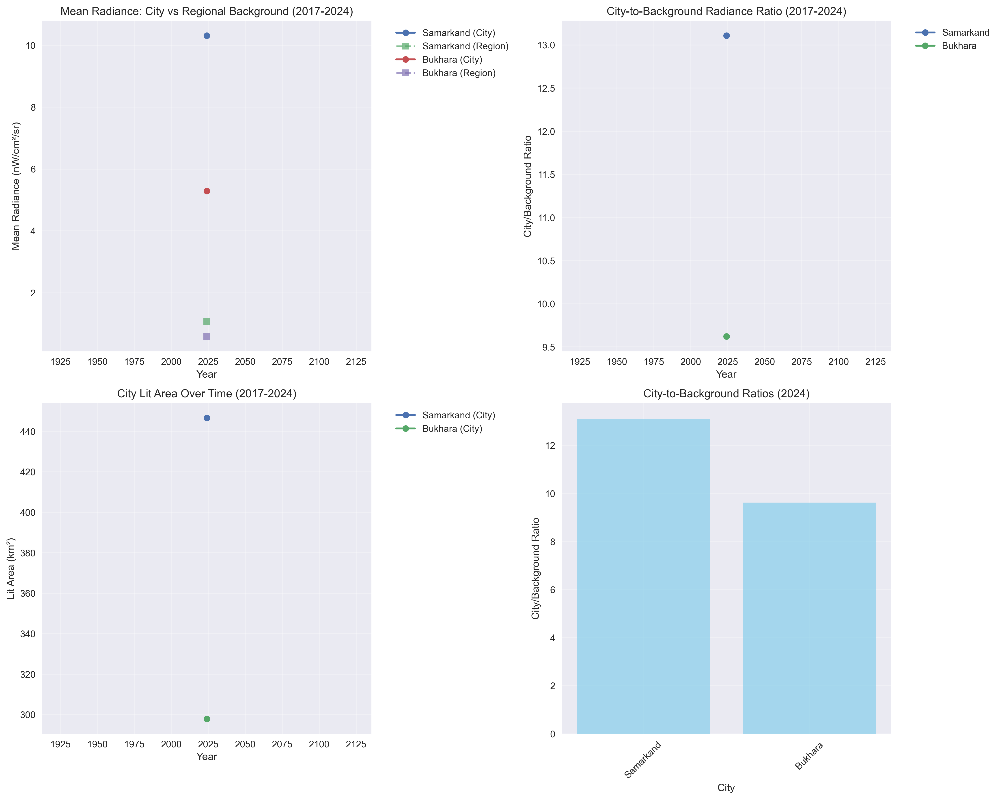
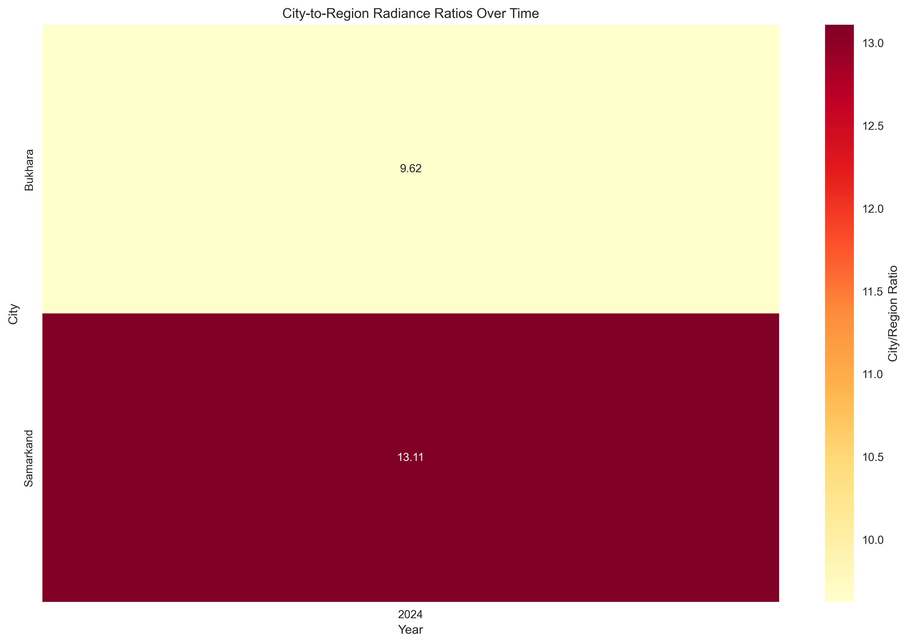

# Uzbekistan Nightlight Regional Analysis Report

**Generated:** 2025-09-29 12:17:12 UTC

**Analysis Period:** 2017-2024

**Total Analyses:** 2
**Successful:** 2
**Failed:** 0

## Overview

This report presents a comprehensive analysis of nighttime lights in Uzbekistan, comparing urban centers with their surrounding regional contexts from 2017 to 2024. The analysis uses VIIRS DNB monthly composites to examine:

- City + buffer zone radiance vs regional averages
- Temporal trends in urban vs regional development
- Comparative growth patterns across regions

## Key Findings

### 2024 City-to-Region Ratios

- **Samarkand** (Samarkand Region): 13.11x
- **Bukhara** (Bukhara Region): 9.62x

### Growth Trends (2017-2024)

## Methodology

### Data Sources
- **Nightlight Data:** VIIRS DNB Monthly Composites (NOAA/VIIRS/DNB/MONTHLY_V1/VCMCFG)
- **Administrative Boundaries:** FAO GAUL Simplified 500m (2015)
- **Temporal Coverage:** January 2017 - December 2024

### Analysis Zones
- **City Core:** Urban center with configured buffer (circular: 8-15km radius)
- **City Buffer:** Extended urban area (1.2x city core, circular)
- **Administrative Region:** Actual regional administrative boundary (FAO GAUL)
- **Regional Background:** Administrative region excluding city buffer

### Metrics Calculated
- Mean radiance (nanoWatts/cm²/sr)
- Median radiance
- Standard deviation
- Lit area (km² above 1.0 threshold)
- City-to-region ratio
- City-background difference

## Visualizations

## Data Files

- `uzbekistan_nightlight_regional_analysis.csv` - Complete results dataset
- Individual city JSON files in subdirectories
- Thumbnail images in `thumbnails/` directory

