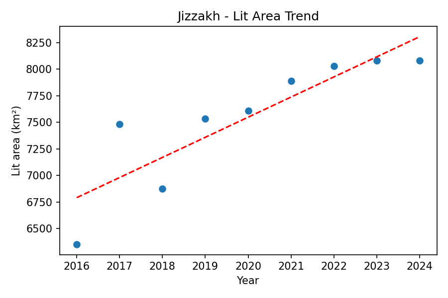

# Nightlights Analysis Summary
Generated: 2025-08-25T16:41:36.101011

## Trends (lit area km² per year)
- Tashkent: slope = 1.9060 km²/year (n=9)
- Nukus: slope = 612.6368 km²/year (n=9)
- Andijan: slope = 52.2437 km²/year (n=9)
- Bukhara: slope = 197.9407 km²/year (n=9)
- Samarkand: slope = 87.2487 km²/year (n=9)
- Namangan: slope = 63.7150 km²/year (n=9)
- Jizzakh: slope = 189.3920 km²/year (n=9)
- Qarshi: slope = 77.2285 km²/year (n=9)
- Navoiy: slope = 326.2670 km²/year (n=9)
- Termez: slope = 458.8988 km²/year (n=9)
- Gulistan: slope = 397.3255 km²/year (n=9)
- Nurafshon: slope = 134.3660 km²/year (n=9)
- Fergana: slope = 297.9868 km²/year (n=9)
- Urgench: slope = 702.2562 km²/year (n=9)

## Per-city trend plots
### Tashkent

### Nukus

### Andijan

### Bukhara

### Samarkand

### Namangan

### Jizzakh

### Qarshi

### Navoiy

### Termez

### Gulistan

### Nurafshon

### Fergana

### Urgench

## Details
- Tashkent 2016: mean=43.666233618951615, median=21.0, lit_area_km2=7907.41
- Tashkent 2017: mean=46.015504032258065, median=21.0, lit_area_km2=7936.0
- Tashkent 2018: mean=48.153060735887095, median=21.0, lit_area_km2=7936.0
- Tashkent 2019: mean=57.12267893145161, median=27.0, lit_area_km2=7936.0
- Tashkent 2020: mean=60.11204637096774, median=30.0, lit_area_km2=7936.0
- Tashkent 2021: mean=71.26422631048388, median=40.0, lit_area_km2=7936.0
- Tashkent 2022: mean=68.9008984375, median=41.0, lit_area_km2=7936.0
- Tashkent 2023: mean=71.68251512096774, median=44.0, lit_area_km2=7936.0
- Tashkent 2024: mean=70.63481476814516, median=43.0, lit_area_km2=7936.0
- Nukus 2016: mean=2.0605096603975035, median=0.0, lit_area_km2=1846.04
- Nukus 2017: mean=3.0812356274638635, median=1.0, lit_area_km2=3009.1
- Nukus 2018: mean=4.247491222486859, median=1.0, lit_area_km2=3132.14
- Nukus 2019: mean=5.445782173948752, median=1.0, lit_area_km2=3840.26
- Nukus 2020: mean=6.55891841532523, median=2.0, lit_area_km2=4710.69
- Nukus 2021: mean=7.841085947766097, median=2.0, lit_area_km2=5683.21
- Nukus 2022: mean=7.513222733245729, median=2.0, lit_area_km2=5907.54
- Nukus 2023: mean=5.675791516097241, median=2.0, lit_area_km2=6345.68
- Nukus 2024: mean=5.5370952591162945, median=2.0, lit_area_km2=6684.72
- Andijan 2016: mean=7.971976032330346, median=4.0, lit_area_km2=7301.25
- Andijan 2017: mean=7.740544474231754, median=4.0, lit_area_km2=7954.84
- Andijan 2018: mean=10.145211467669654, median=5.0, lit_area_km2=7886.41
- Andijan 2019: mean=11.634350492157491, median=6.0, lit_area_km2=7997.44
- Andijan 2020: mean=13.399351542493598, median=6.0, lit_area_km2=7997.44
- Andijan 2021: mean=15.502677106674136, median=7.0, lit_area_km2=7997.44
- Andijan 2022: mean=16.55444492237516, median=7.0, lit_area_km2=7997.44
- Andijan 2023: mean=17.852151438460307, median=8.0, lit_area_km2=7997.44
- Andijan 2024: mean=17.160911491677336, median=8.0, lit_area_km2=7997.44
- Bukhara 2016: mean=6.6847907471626735, median=3.0, lit_area_km2=6146.42
- Bukhara 2017: mean=7.007648713351198, median=3.0, lit_area_km2=7512.12
- Bukhara 2018: mean=7.895207331730769, median=3.0, lit_area_km2=7178.27
- Bukhara 2019: mean=12.414824785230138, median=4.0, lit_area_km2=7848.18
- Bukhara 2020: mean=12.969801682692308, median=4.0, lit_area_km2=7952.49
- Bukhara 2021: mean=16.815812677332914, median=5.0, lit_area_km2=8120.32
- Bukhara 2022: mean=19.108904575189154, median=6.0, lit_area_km2=8120.32
- Bukhara 2023: mean=15.592073957676545, median=6.0, lit_area_km2=8120.32
- Bukhara 2024: mean=14.182441086065573, median=6.0, lit_area_km2=8120.32
- Samarkand 2016: mean=12.035563356029597, median=5.0, lit_area_km2=7085.1
- Samarkand 2017: mean=12.432598738586272, median=6.0, lit_area_km2=7951.57
- Samarkand 2018: mean=13.07664047740869, median=6.0, lit_area_km2=7889.02
- Samarkand 2019: mean=15.359576708123425, median=7.0, lit_area_km2=8097.53
- Samarkand 2020: mean=17.892382566514485, median=9.0, lit_area_km2=8128.0
- Samarkand 2021: mean=26.940986844694585, median=13.0, lit_area_km2=8130.56
- Samarkand 2022: mean=30.834647305966623, median=15.0, lit_area_km2=8130.56
- Samarkand 2023: mean=32.33562632832179, median=16.0, lit_area_km2=8130.56
- Samarkand 2024: mean=27.520483213948363, median=15.0, lit_area_km2=8130.56
- Namangan 2016: mean=8.831859284624036, median=4.0, lit_area_km2=7254.52
- Namangan 2017: mean=8.402380151429949, median=4.0, lit_area_km2=7880.32
- Namangan 2018: mean=8.385619175771208, median=4.0, lit_area_km2=7613.77
- Namangan 2019: mean=9.403227426092545, median=5.0, lit_area_km2=7957.72
- Namangan 2020: mean=9.468785146208226, median=5.0, lit_area_km2=7957.72
- Namangan 2021: mean=12.610741936455655, median=6.0, lit_area_km2=7966.72
- Namangan 2022: mean=13.460106543219794, median=6.0, lit_area_km2=7966.72
- Namangan 2023: mean=15.615244416773779, median=8.0, lit_area_km2=7966.72
- Namangan 2024: mean=15.234366213447943, median=7.0, lit_area_km2=7966.72
- Jizzakh 2016: mean=8.656777269486692, median=5.0, lit_area_km2=6352.13
- Jizzakh 2017: mean=9.61875321807668, median=5.0, lit_area_km2=7483.04
- Jizzakh 2018: mean=8.775664161517744, median=4.0, lit_area_km2=6875.87
- Jizzakh 2019: mean=8.635662973304816, median=4.0, lit_area_km2=7533.27
- Jizzakh 2020: mean=9.872597581986692, median=5.0, lit_area_km2=7607.82
- Jizzakh 2021: mean=14.159579471641319, median=6.0, lit_area_km2=7889.91
- Jizzakh 2022: mean=15.30415156646071, median=8.0, lit_area_km2=8030.37
- Jizzakh 2023: mean=17.558703907240176, median=9.0, lit_area_km2=8079.36
- Jizzakh 2024: mean=16.818684895833332, median=9.0, lit_area_km2=8079.36
- Qarshi 2016: mean=11.029499970812578, median=6.0, lit_area_km2=7352.65
- Qarshi 2017: mean=10.951900344411582, median=7.0, lit_area_km2=8153.05
- Qarshi 2018: mean=9.249862575887297, median=5.0, lit_area_km2=7771.4
- Qarshi 2019: mean=11.346064319349315, median=6.0, lit_area_km2=8180.94
- Qarshi 2020: mean=12.70873141734122, median=6.0, lit_area_km2=8213.68
- Qarshi 2021: mean=16.711899468788918, median=8.0, lit_area_km2=8222.72
- Qarshi 2022: mean=18.47376537204234, median=9.0, lit_area_km2=8222.72
- Qarshi 2023: mean=20.412338009806973, median=12.0, lit_area_km2=8222.72
- Qarshi 2024: mean=17.805178821606475, median=11.0, lit_area_km2=8222.72
- Navoiy 2016: mean=6.2384310143377695, median=2.0, lit_area_km2=5260.41
- Navoiy 2017: mean=7.290407903596324, median=3.0, lit_area_km2=6590.6
- Navoiy 2018: mean=7.515514842759822, median=3.0, lit_area_km2=6318.18
- Navoiy 2019: mean=11.40268659893853, median=3.0, lit_area_km2=7256.34
- Navoiy 2020: mean=14.42841388426806, median=4.0, lit_area_km2=7661.12
- Navoiy 2021: mean=16.892748930608366, median=4.0, lit_area_km2=7950.38
- Navoiy 2022: mean=16.52530522219582, median=4.0, lit_area_km2=7984.66
- Navoiy 2023: mean=13.904206521308618, median=5.0, lit_area_km2=8024.7
- Navoiy 2024: mean=13.714439014971482, median=5.0, lit_area_km2=8072.09
- Termez 2016: mean=5.00995356272838, median=1.0, lit_area_km2=4055.42
- Termez 2017: mean=5.971431086327649, median=2.0, lit_area_km2=5989.85
- Termez 2018: mean=6.171861915727771, median=2.0, lit_area_km2=5598.25
- Termez 2019: mean=8.795112191686966, median=2.0, lit_area_km2=6082.73
- Termez 2020: mean=9.744238162302072, median=3.0, lit_area_km2=6749.28
- Termez 2021: mean=10.982838192752741, median=3.0, lit_area_km2=7205.48
- Termez 2022: mean=11.650710594929963, median=3.0, lit_area_km2=7762.0
- Termez 2023: mean=12.439085575898295, median=4.0, lit_area_km2=7991.93
- Termez 2024: mean=10.853126665271011, median=3.0, lit_area_km2=8074.78
- Gulistan 2016: mean=5.36563795440051, median=2.0, lit_area_km2=4633.14
- Gulistan 2017: mean=6.143471231265944, median=2.0, lit_area_km2=6549.58
- Gulistan 2018: mean=6.293024802694515, median=2.0, lit_area_km2=5162.06
- Gulistan 2019: mean=9.083694146603953, median=3.0, lit_area_km2=6986.97
- Gulistan 2020: mean=9.808380749760842, median=3.0, lit_area_km2=7013.12
- Gulistan 2021: mean=11.70943528778699, median=3.0, lit_area_km2=7769.48
- Gulistan 2022: mean=9.966459313217474, median=3.0, lit_area_km2=7682.66
- Gulistan 2023: mean=10.07187201052296, median=3.0, lit_area_km2=8028.16
- Gulistan 2024: mean=10.105304328762756, median=3.0, lit_area_km2=8028.16
- Nurafshon 2016: mean=3.9183089150867607, median=2.0, lit_area_km2=6275.38
- Nurafshon 2017: mean=4.567214612789203, median=3.0, lit_area_km2=7914.94
- Nurafshon 2018: mean=3.8786577160989717, median=3.0, lit_area_km2=7421.4
- Nurafshon 2019: mean=4.99762763094473, median=3.0, lit_area_km2=7916.1
- Nurafshon 2020: mean=5.358935672397172, median=4.0, lit_area_km2=7966.72
- Nurafshon 2021: mean=6.5504724654562985, median=4.0, lit_area_km2=7966.72
- Nurafshon 2022: mean=7.013803673280848, median=4.0, lit_area_km2=7966.72
- Nurafshon 2023: mean=7.103863321417095, median=5.0, lit_area_km2=7966.72
- Nurafshon 2024: mean=7.035403528679306, median=5.0, lit_area_km2=7966.72
- Fergana 2016: mean=5.820666597089694, median=2.0, lit_area_km2=5182.67
- Fergana 2017: mean=6.416984732824427, median=3.0, lit_area_km2=6976.87
- Fergana 2018: mean=6.2633823850986, median=3.0, lit_area_km2=6632.6
- Fergana 2019: mean=8.415370795562977, median=4.0, lit_area_km2=7558.33
- Fergana 2020: mean=8.249539052560433, median=4.0, lit_area_km2=7493.73
- Fergana 2021: mean=12.938921358142494, median=6.0, lit_area_km2=7995.8
- Fergana 2022: mean=11.15470439726463, median=5.0, lit_area_km2=8017.25
- Fergana 2023: mean=11.990055462786259, median=6.0, lit_area_km2=8046.39
- Fergana 2024: mean=11.490033098759541, median=6.0, lit_area_km2=8048.64
- Urgench 2016: mean=2.966376902525907, median=1.0, lit_area_km2=2548.69
- Urgench 2017: mean=3.4257761900906734, median=2.0, lit_area_km2=4072.17
- Urgench 2018: mean=4.654248805861399, median=2.0, lit_area_km2=4144.75
- Urgench 2019: mean=6.030854062095207, median=2.0, lit_area_km2=5521.08
- Urgench 2020: mean=6.560978232270077, median=2.0, lit_area_km2=6223.35
- Urgench 2021: mean=7.8412137204501295, median=3.0, lit_area_km2=7522.87
- Urgench 2022: mean=8.62134674546632, median=3.0, lit_area_km2=7751.32
- Urgench 2023: mean=8.941814837678109, median=3.0, lit_area_km2=7903.53
- Urgench 2024: mean=9.230667351441062, median=3.0, lit_area_km2=7905.28
