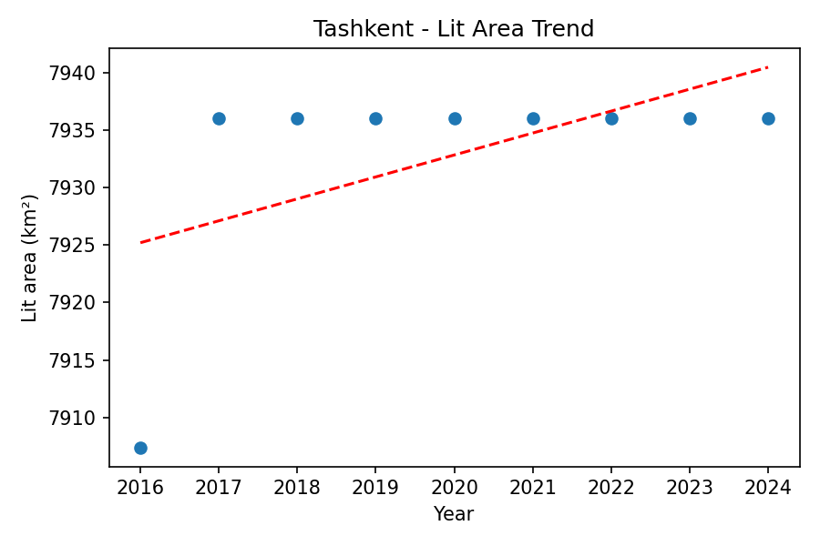

# Nightlights Analysis Summary
Generated: 2025-08-22T07:43:07.803741

## Trends (lit area km² per year)
- Tashkent: slope = 1.9060 km²/year (n=9)
- Nukus: slope = 612.6368 km²/year (n=9)

## Per-city trend plots
### Tashkent

### Nukus

## Details
- Tashkent 2016: mean=43.666233618951615, median=21.0, lit_area_km2=7907.41
- Tashkent 2017: mean=46.015504032258065, median=21.0, lit_area_km2=7936.0
- Tashkent 2018: mean=48.153060735887095, median=21.0, lit_area_km2=7936.0
- Tashkent 2019: mean=57.12267893145161, median=27.0, lit_area_km2=7936.0
- Tashkent 2020: mean=60.11204637096774, median=30.0, lit_area_km2=7936.0
- Tashkent 2021: mean=71.26422631048388, median=40.0, lit_area_km2=7936.0
- Tashkent 2022: mean=68.9008984375, median=41.0, lit_area_km2=7936.0
- Tashkent 2023: mean=71.68251512096774, median=44.0, lit_area_km2=7936.0
- Tashkent 2024: mean=70.63481476814516, median=43.0, lit_area_km2=7936.0
- Nukus 2016: mean=2.0605096603975035, median=0.0, lit_area_km2=1846.04
- Nukus 2017: mean=3.0812356274638635, median=1.0, lit_area_km2=3009.1
- Nukus 2018: mean=4.247491222486859, median=1.0, lit_area_km2=3132.14
- Nukus 2019: mean=5.445782173948752, median=1.0, lit_area_km2=3840.26
- Nukus 2020: mean=6.55891841532523, median=2.0, lit_area_km2=4710.69
- Nukus 2021: mean=7.841085947766097, median=2.0, lit_area_km2=5683.21
- Nukus 2022: mean=7.513222733245729, median=2.0, lit_area_km2=5907.54
- Nukus 2023: mean=5.675791516097241, median=2.0, lit_area_km2=6345.68
- Nukus 2024: mean=5.5370952591162945, median=2.0, lit_area_km2=6684.72
